# Sistema de Gestión Hospitalaria

Aplicación web multiusuario para administrar la operación de una red de
hospitales. Permite gestionar pacientes, personal médico, citas, expedientes,
tratamientos, prescripciones, inventario de medicamentos y pagos.

Este proyecto fue desarrollado como una aplicación académica de base de datos,
con una arquitectura por capas y reglas de negocio separadas del acceso a datos.

## Funcionalidades

- Autenticación y navegación según el rol del usuario.
- Administración de hospitales, médicos, empleados, pacientes y medicamentos.
- Registro, consulta y cancelación de citas.
- Atención médica con diagnósticos, tratamientos y prescripciones.
- Expediente e historial de citas por paciente.
- Control de existencias de medicamentos por hospital.
- Registro e historial de pagos.
- Paneles de resumen para administración, recepción y personal médico.

## Tecnologías

- C#
- ASP.NET Web Forms
- .NET Framework 4.8
- SQL Server y ADO.NET
- Bootstrap 5 y jQuery
- Visual Studio

## Arquitectura

```text
UIL  -> interfaz web y manejo de sesión
BLL  -> validaciones y reglas de negocio
DAL  -> consultas parametrizadas y acceso a SQL Server
EDL  -> entidades y modelos de transferencia
```

La base de datos incluye tablas relacionadas, procedimientos almacenados y un
trigger que valida y descuenta existencias cuando se registra una prescripción.

## Requisitos

- Windows
- Visual Studio 2022 con la carga de trabajo **Desarrollo de ASP.NET y web**
- .NET Framework 4.8 Developer Pack
- SQL Server 2019 o posterior
- SQL Server Management Studio, recomendado

## Instalación local

1. Clona este repositorio.
2. Ejecuta, en orden, `database/01_HospitalDB.sql`,
   `database/02_actualizar_costos_tratamientos.sql` y
   `database/03_agrupar_pagos_por_cita.sql` en SQL Server Management Studio.
3. Ajusta la conexión `cnn` de `UIL/Web.config` si tu instancia no utiliza
   `Data Source=localhost`.
4. Abre `BD_Hospital.slnx` en Visual Studio.
5. Restaura los paquetes NuGet de la solución.
6. Establece `UIL` como proyecto de inicio y ejecuta la aplicación.

## Usuarios de demostración

El script incluye información ficticia para ejecutar el proyecto localmente.
Algunos usuarios disponibles son:

| Rol | Usuario | Contraseña |
| --- | --- | --- |
| Administrador | `admin1` | `123456` |
| Recepcionista | `recepcion1` | `123456` |
| Médico | `drmartinez` | `123456` |
| Paciente | `paciente1` | `123456` |

Estas credenciales son exclusivamente para una base de datos local de
demostración. No deben usarse en un despliegue público.

## Seguridad

- Las contraseñas se almacenan mediante PBKDF2-HMAC-SHA256 con salt.
- Las consultas de autenticación utilizan parámetros SQL.
- La cadena de conexión de ejemplo usa autenticación integrada de Windows y no
  contiene credenciales.
- Los errores internos no se muestran en la pantalla de inicio de sesión.

## Estructura del repositorio

```text
BLL/       Reglas de negocio
DAL/       Acceso a datos
EDL/       Entidades
UIL/       Aplicación ASP.NET Web Forms
database/  Creación y mejoras de la base de datos
docs/      Material visual del proyecto
```

## Capturas

Las pantallas utilizan exclusivamente la información ficticia incluida en el
script de demostración.

### Acceso al sistema

<p align="center">
  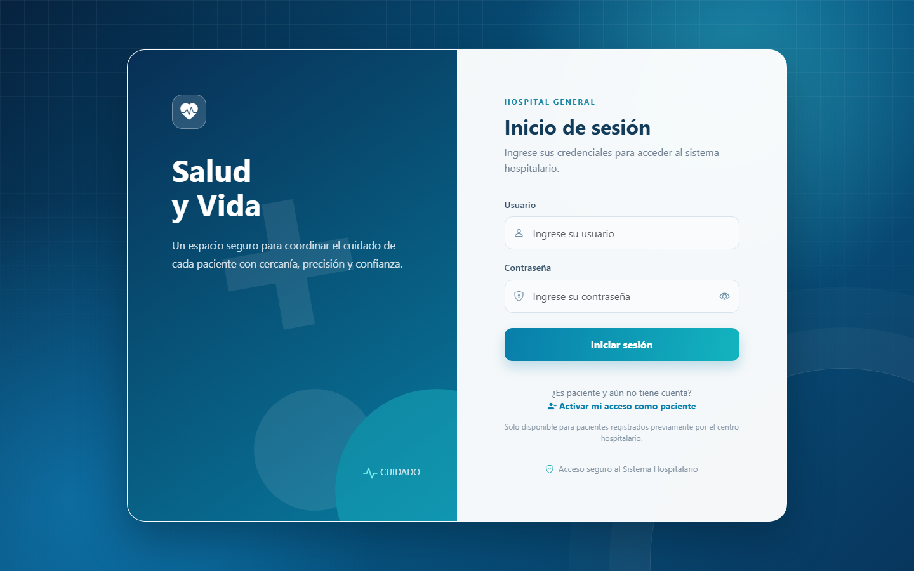
</p>

### Administración

<table>
  <tr>
    <td width="50%">
      <strong>Panel administrativo</strong><br>
      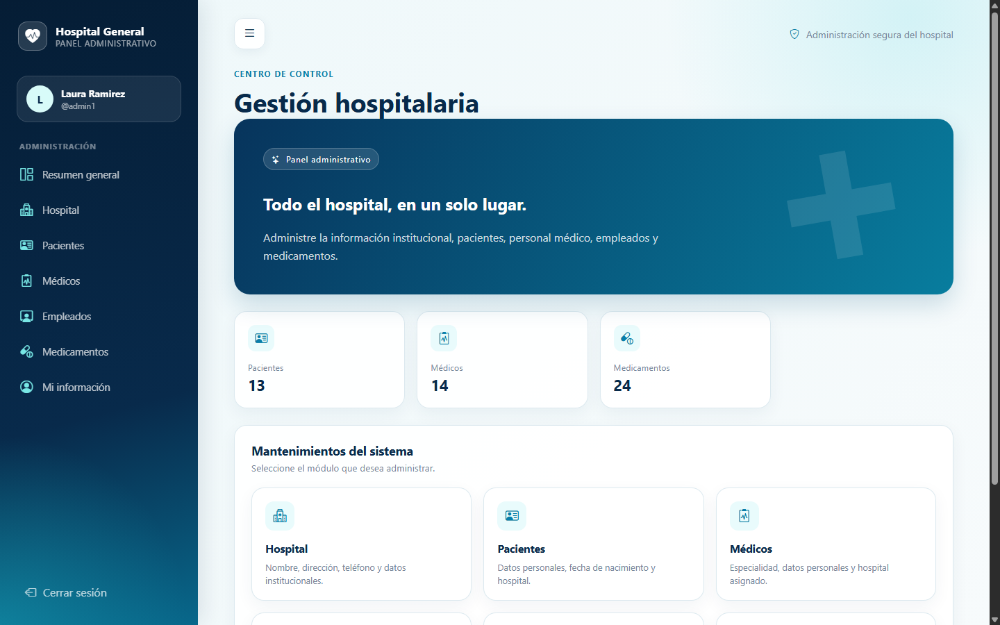
    </td>
    <td width="50%">
      <strong>Gestión de medicamentos</strong><br>
      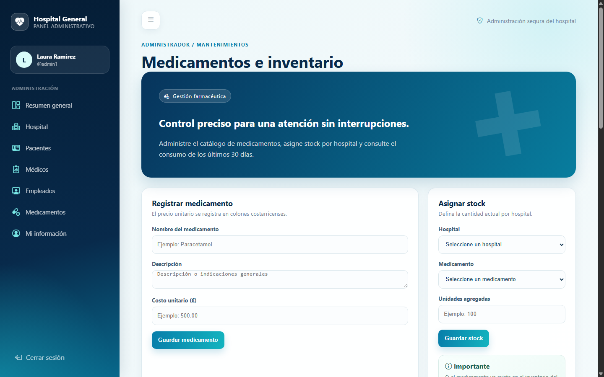
    </td>
  </tr>
  <tr>
    <td colspan="2">
      <strong>Catálogo e inventario</strong><br>
      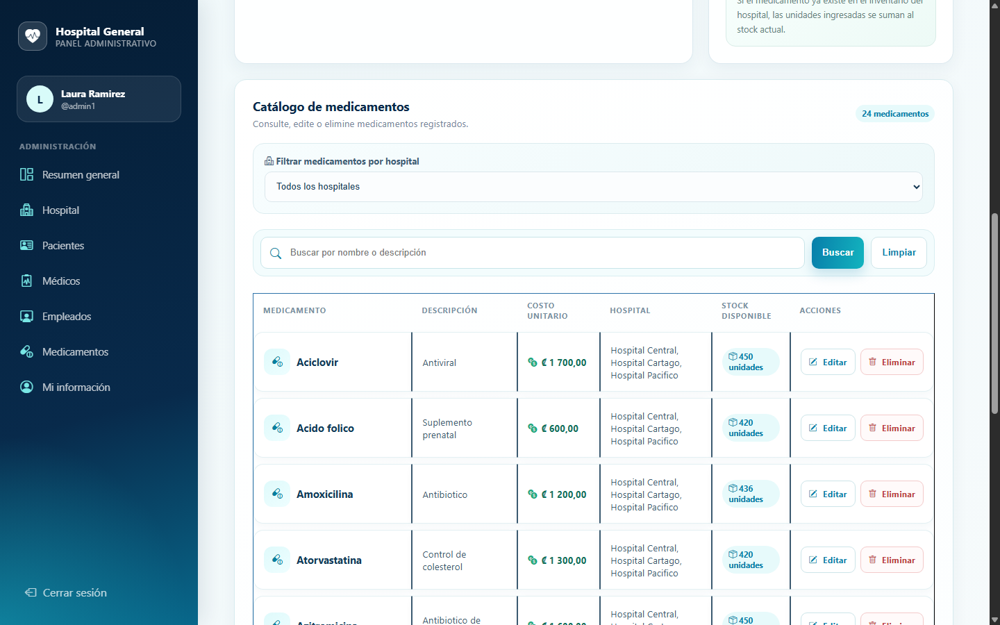
    </td>
  </tr>
</table>

### Recepción

<table>
  <tr>
    <td width="50%">
      <strong>Panel de recepción</strong><br>
      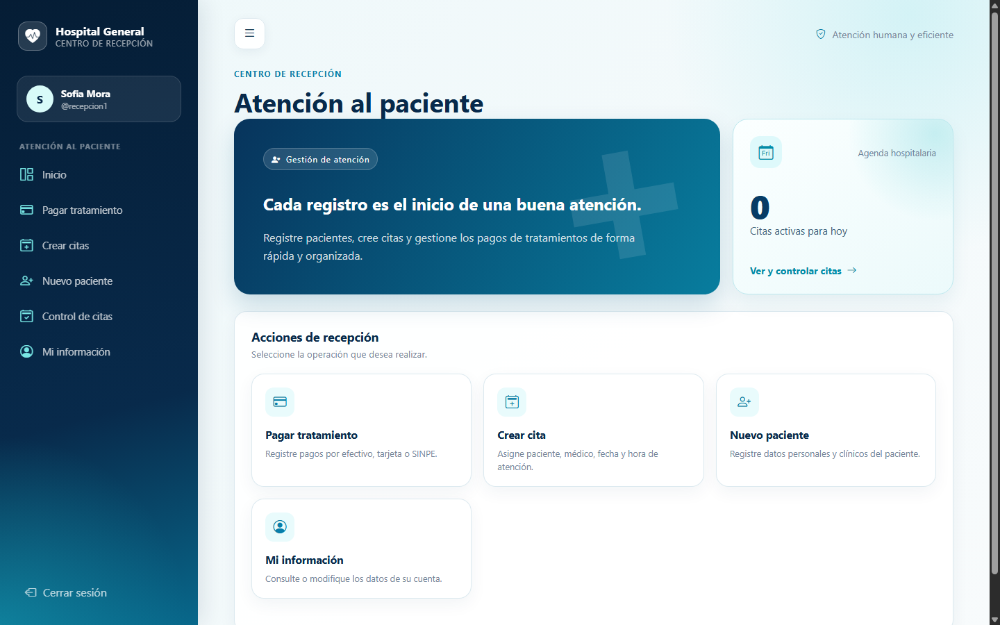
    </td>
    <td width="50%">
      <strong>Creación de citas</strong><br>
      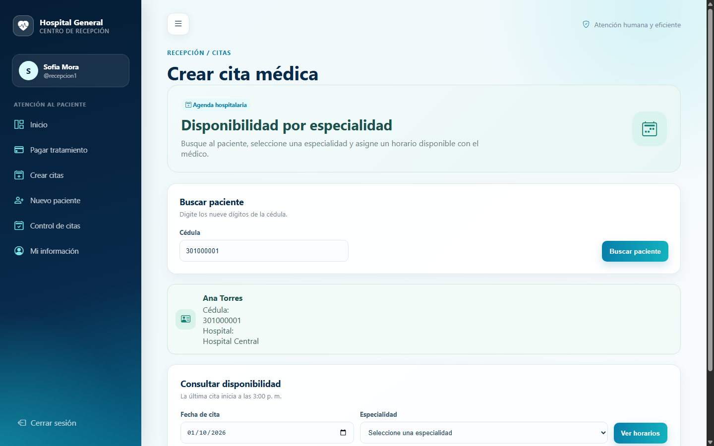
    </td>
  </tr>
</table>

### Portal médico

<table>
  <tr>
    <td width="50%">
      <strong>Jornada clínica</strong><br>
      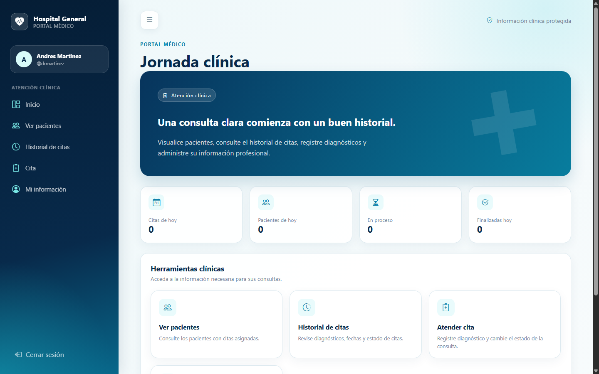
    </td>
    <td width="50%">
      <strong>Historial de citas</strong><br>
      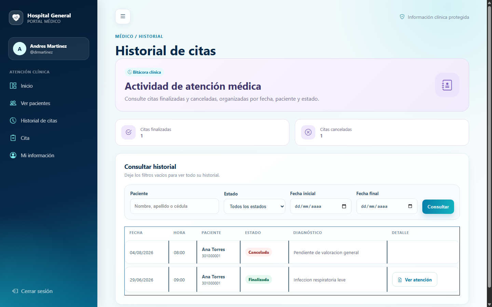
    </td>
  </tr>
  <tr>
    <td colspan="2">
      <strong>Pacientes atendidos</strong><br>
      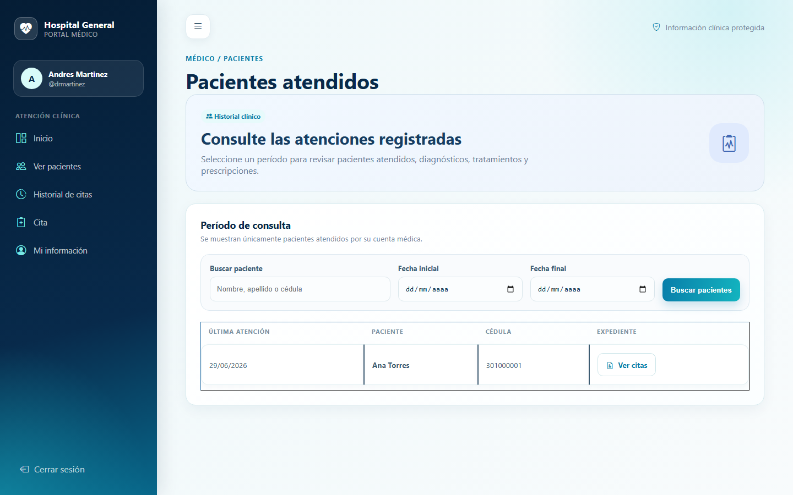
    </td>
  </tr>
</table>

### Portal del paciente

<table>
  <tr>
    <td width="50%">
      <strong>Mi espacio de salud</strong><br>
      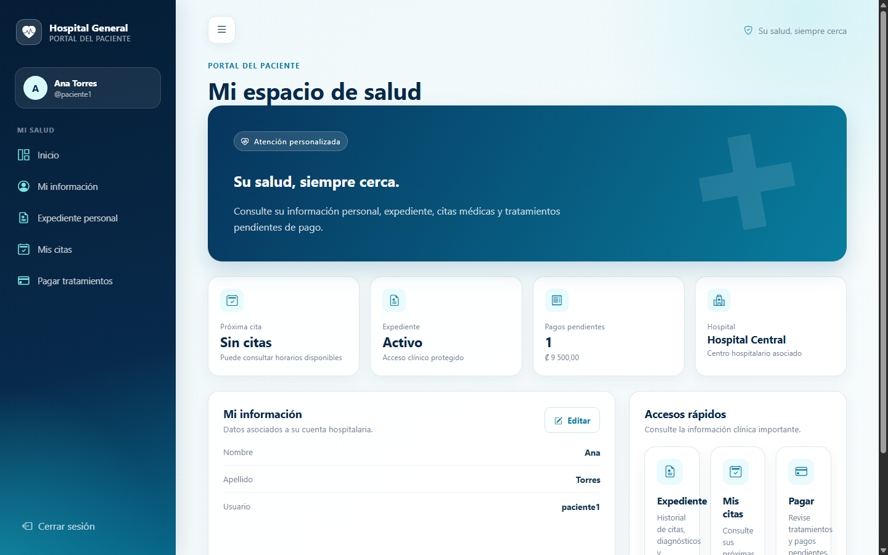
    </td>
    <td width="50%">
      <strong>Agenda de citas</strong><br>
      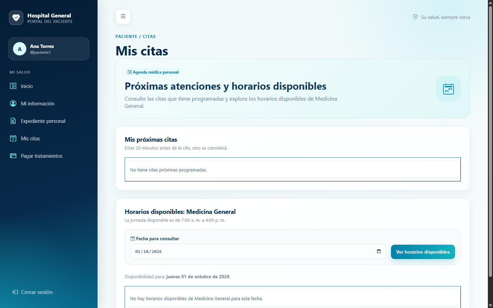
    </td>
  </tr>
  <tr>
    <td width="50%">
      <strong>Expediente personal</strong><br>
      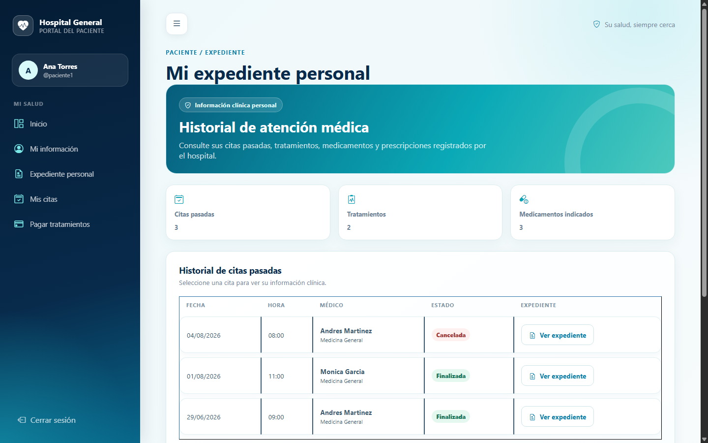
    </td>
    <td width="50%">
      <strong>Pagos de tratamientos</strong><br>
      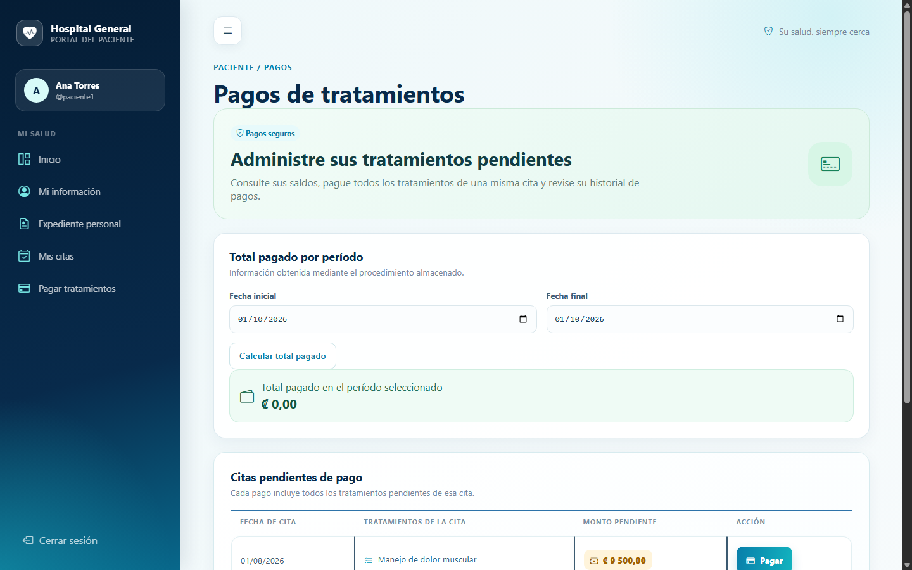
    </td>
  </tr>
</table>

